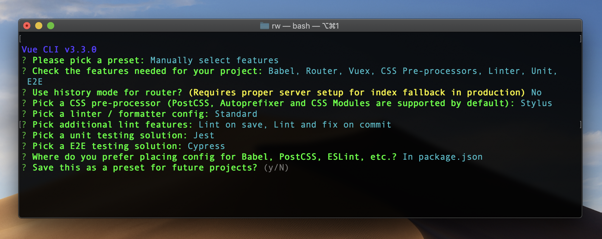
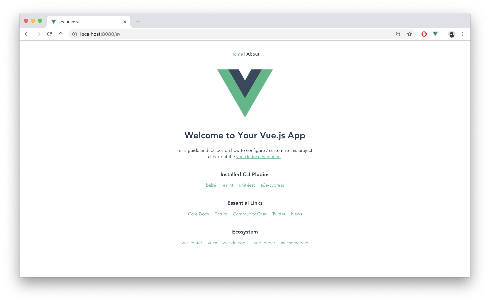

# #1 Vuetify
Material Design Component Framework


## Empezamos
- Agregamos vuetify a nuestro proyecto:  
```
vue add vuetify
```

## Asistente de instalación 
  

```
 ? Please pick a preset: 
   default (babel, eslint) 
 ❯ Manually select features  
```

```  
(Marcamos las opciones con el espacio)

? Check the features needed for your project:  
  ◉ Babel  
  ◯ TypeScript  
  ◯ Progressive Web App (PWA) Support  
  ◉ Router  
  ◉ Vuex  
  ◉ CSS Pre-processors  
  ◉ Linter / Formatter  
  ◉ Unit Testing  
  ◉ E2E Testing  
   ```

```
? Use history mode for router? 
(Requires proper server setup for index fallback in production) (Y/n): n
```

```
? Pick a CSS pre-processor (PostCSS, Autoprefixer and CSS Modules are supported by default):   
    Sass/SCSS  
    Less  
  ❯ Stylus  
```

```
? Pick a linter / formatter config: 
    ESLint with error prevention only   
    ESLint + Airbnb config   
  ❯ ESLint + Standard config   
    ESLint + Prettier   
```

```
(Marcamos las opciones con el espacio)

? Pick additional lint features: 
 ◉ Lint on save
 ◉ Lint and fix on commit
```

```
? Pick a unit testing solution: 
  Mocha + Chai 
❯ Jest
```

```
? Pick a E2E testing solution: 
❯ Cypress (Chrome only) 
  Nightwatch (Selenium-based)
```
---




---

👌 Si la instalación ha sido correcta, veremos un mensaje como este:
```
🎉  Successfully created project recursosw.
👉  Get started with the following commands
```

## Ejecutando la app
Para ejecutar la app hacemos lo siguiente:

```bash
  $ cd recursosw
  
  $ npm run serve
  # OR 
  $ yarn serve 
```

--- 

## Hello World!
Vista previa de la app  

  
  
---

## Conclusiones

:trollface:
  
   


  
   
